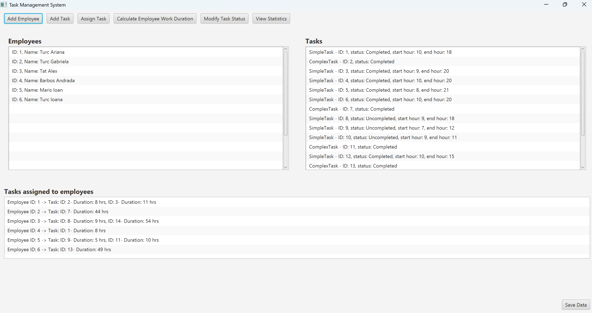

# 🗂️ Task Management System (Java, OOP, JavaFX)

## 📖 Overview
This project is an **Employee Task Management System** built in Java for the **Fundamental Programming Techniques** course (2025, Technical University of Cluj-Napoca).  

It allows a project manager of a software company to:  
- Add employees  
- Create and assign tasks (simple or complex)  
- View employees and their tasks  
- Track the status of tasks (Completed / Uncompleted)  
- View work duration statistics  
- Persist data between sessions using **serialization**  

The system follows **object-oriented programming principles**, uses a **layered architecture**, and provides an interactive **JavaFX GUI** for management.

---

## 👩‍💻 Features
- ✔️ **Employee Management**: Add and list employees.  
- ✔️ **Task Management**:  
  - Create **SimpleTask** (with start and end hours).  
  - Create **ComplexTask** (composed of simple and/or complex tasks).  
  - Assign tasks to employees.  
- ✔️ **Task Tracking**:  
  - Update task status (Completed / Uncompleted).  
  - Estimate task durations automatically.  
- ✔️ **Statistics & Reporting**:  
  - Calculate each employee’s total work duration (only for completed tasks).  
  - Filter and display employees working more than 40 hours, sorted by duration.  
  - Count completed vs uncompleted tasks per employee.  
- ✔️ **Persistence**: All data (employees, tasks, statuses) is stored using **serialization**.  
- ✔️ **GUI**: JavaFX interface for project managers to interact with the system.  

---

## 🏗️ Project Structure

### Core Classes
- **Employee** → Represents an employee (ID, name).  
- **Task (abstract, sealed)** → Base class for all tasks.
  - **SimpleTask** → Task with start and end hours; calculates duration directly.  
  - **ComplexTask** → Task composed of subtasks (simple and/or complex). Duration = sum of subtasks.  
- **TasksManagement** → Main logic for:  
  - Assigning tasks to employees  
  - Calculating work duration  
  - Modifying task status  
- **Utility** → Provides statistics and reports:  
  - Filters employees working more than 40 hours and sorts them  
  - Calculates completed/uncompleted tasks per employee  
- **DataPersistence** → Handles saving/loading application state via serialization.  

### GUI (JavaFX)
The **JavaFX interface** allows the project manager to:  
- Add employees and tasks  
- Assign tasks  
- Modify task statuses  
- View employees, tasks, and statistics
- Calculate employee work duration

---

## ⚙️ Tech Stack
- **Language**: Java (OOP, sealed classes)  
- **GUI**: JavaFX  
- **Persistence**: Serialization (Java IO)  
- **Architecture**: Layered design (dataModel, businessLogic, dataAccess, UI)

---

## 📷 GUI Preview

Here is a screenshot of the application’s interface:

